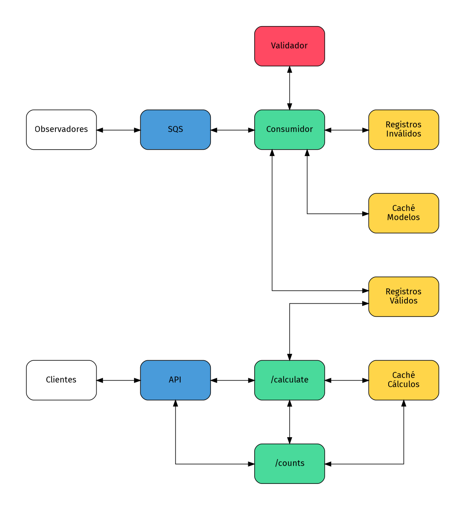

# Laboratorio 9: Procesos Asíncronos, Mensajería y Cache con AWS SQS y DynamoDB

En este laboratorio exploraremos el desarrollo de sistemas distribuidos asíncronos utilizando AWS SQS para mensajería, DynamoDB para cache y almacenamiento. Implementaremos un sistema de registro de avistamientos de naves espaciales que valida modelos de naves contra servicios externos, implementa cache inteligente y maneja procesamiento asíncrono mediante colas FIFO.

## Marco Teórico

### Arquitecturas Asíncronas y Mensajería

Las arquitecturas asíncronas permiten que los componentes de un sistema operen independientemente, comunicándose a través de mensajes sin esperar respuestas inmediatas. Esto mejora la escalabilidad, resilencia y capacidad de procesamiento del sistema.

#### AWS Simple Queue Service (SQS)

SQS es un servicio de colas de mensajes completamente administrado que permite desacoplar y escalar microservicios, sistemas distribuidos y aplicaciones serverless.

**Tipos de colas:**

-   **Standard**: Entrega de mensajes al menos una vez, orden aproximado
-   **FIFO**: Entrega exactamente una vez, orden estricto (First In, First Out)

**Características principales:**

-   **Escalabilidad automática**: Maneja desde 1 hasta millones de mensajes
-   **Durabilidad**: Los mensajes se almacenan de forma redundante
-   **Visibility timeout**: Previene que múltiples consumidores procesen el mismo mensaje
-   **Dead letter queues**: Manejo de mensajes que fallan repetidamente

#### Status Polling vs Push

**Status Polling:**

-   El consumidor consulta activamente por nuevos mensajes
-   Control sobre la frecuencia de procesamiento
-   Mejor para cargas de trabajo predecibles

**Push (Event-driven):**

-   Los mensajes se entregan automáticamente al consumidor
-   Menor latencia para procesamiento inmediato
-   Mejor para cargas de trabajo variables

### Estrategias de Cache

El cache es una técnica fundamental para mejorar el rendimiento y reducir la carga en servicios externos o bases de datos principales.

#### Cache con TTL (Time To Live)

La expiración automática de cache mediante TTL previene el uso de datos obsoletos y reduce el uso de almacenamiento.

### Integración de Servicios Externos

En sistemas distribuidos es común integrar múltiples servicios externos para validación, enriquecimiento de datos o procesamiento especializado.

**Consideraciones:**

-   **Latencia**: Impacto en tiempos de respuesta
-   **Disponibilidad**: Manejo de fallos del servicio externo
-   **Rate limiting**: Respeto a límites de uso del servicio
-   **Cache**: Reducción de llamadas repetitivas

## Arquitectura del Sistema

El sistema implementará la siguiente arquitectura:



### Componentes principales:

1. **Cola SQS FIFO**: `spaceships-sightings` - Recibe avistamientos
2. **Consumer Lambda**: `spaceships-consumer` - Procesa avistamientos y valida modelos
3. **Calculator Lambda**: `spaceships-calculator` - Calcula estadísticas de avistamientos
4. **Counts Lambda**: `spaceships-counts` - Proporciona acceso con cache a estadísticas
5. **Tablas DynamoDB**:
    - `spaceships-sightings`: Avistamientos válidos
    - `spaceships-false-reports`: Avistamientos inválidos
    - `spaceships-cache-model`: Cache de validación de modelos
    - `spaceships-cache-stats`: Cache de estadísticas calculadas
6. **API Gateway**: Exposición de endpoints RESTful para consulta
    - `/calculate`: Invoca cálculo de estadísticas
    - `/counts`: Consulta avistamientos

### Descripción global del flujo:

Dadas los continuos ataques a la infraestructura crítica del Imperio Galáctico por parte de la Alianza Rebelde, se ha implementado un sistema de monitoreo de avistamientos de naves espaciales. El objetivo es que los ciudadanos leales a nuestro Emperador reporten cualquier avistamiento de naves sospechosas. Estos reportes serán procesados de manera asíncrona para validar la autenticidad de los modelos de naves, calcular estadísticas de avistamientos y proporcionar acceso rápido a esta información mediante cache.

Los observadores reportarán mediante diversos canales (aplicaciones móviles, terminales web, etc.) los avistamientos de naves espaciales, los cuales serán conducidos a una cola SQS FIFO para su procesamiento asíncrono. Los mensajes que llegarán a la cola serán en formato JSON con los siguientes campos:

```json
{
    "spaceship_id": "string",  // Identificador único de la nave
    "model": "string",         // Modelo de la nave reportada
    "quadrant": "string",      // Cuadrante del avistamiento
    "coordinates": {           // Coordenadas del avistamiento
        "x": float,
        "y": float,
        "z": float
    }
}
```

La cola SQS enviará los mensajes a una función Lambda denominada `spaceships-consumer`, la cual se encargará de procesar cada avistamiento. Esta función se dedicará a registrar los avistamientos en la tabla DynamoDB `spaceships-sightings`, sin embargo, antes de almacenar cada avistamiento, realizará una validación del modelo de la nave reportada. Esta validación se llevará a cabo en tres etapas:

1. **Sistema de validación externo**: La función Lambda consultará un servicio externo que proporciona una API REST para validar si el modelo de nave reportado es legítimo. Para realizar esto se debe acceder al endpoint `https://api.algundominio.link/spaceships/models/validator?model={model_name}` que retornará un código HTTP 200 si el modelo es válido, o un código HTTP 404 si el modelo no existe.

2. **Cache de modelos válidos**: Para optimizar el proceso de validación y reducir la latencia, se implementará una tabla DynamoDB denominada `spaceships-cache-model` que actuará como cache para los resultados de validación de modelos. Cada vez que se valide un modelo, el resultado (válido o inválido) se almacenará en esta tabla con un TTL (Time To Live) de 10 minutos. De esta manera, si un modelo ya ha sido validado recientemente, la función Lambda podrá consultar directamente la tabla de cache en lugar de hacer una llamada al servicio externo.

3. **Manejo de avistamientos inválidos**: Si un modelo de nave es determinado como inválido (ya sea por la consulta al servicio externo o por la cache), el avistamiento no será registrado en la tabla principal `spaceships-sightings`. En su lugar, se almacenará en una tabla separada denominada `spaceships-false-reports`, junto con el motivo de la invalidación (por ejemplo, "modelo no existe" o "modelo no corresponde").

La información reportada por esta red de informantes será utilizada para calcular estadísticas de avistamientos. Para ello, se implementará una función Lambda adicional llamada `spaceships-calculator`, la cual se encargará de procesar las solicitudes de cálculo de estadísticas. Esta función podrá ser invocada directamente mediante un llamado GET al endpoint `/calculate` de API Gateway. La función `spaceships-calculator` debe recibir como parámetros del query el `model` o el `spaceship_id`, y calcular la cantidad de avistamientos válidos registrados en los últimos 10 minutos para el modelo o ID especificado. Si no se especifica ningún parámetro la función debe retornar un bad request (400).

Dado que el cálculo de estadísticas puede ser una operación costosa, se implementará una capa de caché adicional utilizando otra tabla DynamoDB denominada `spaceships-cache-stats`. Esta tabla almacenará los resultados de cálculos previos con un TTL de 5 minutos; sin embargo, un llamado a la función `spaceships-calculator` siempre debe forzar el re-cálculo y actualización del cache.

Para acceder de manera eficiente a las estadísticas de avistamientos, se implementará una tercera función Lambda llamada `spaceships-counts`. Esta función estará expuesta mediante un método GET en el endpoint `/counts` de API Gateway. Este endpoint se debe poder utilizar de la misma forma que el endpoint `/calculate`, es decir, aceptando los mismos parámetros de query (`model` o `spaceship_id`). Al recibir una solicitud, esta función primero consultará la tabla de cache `spaceships-cache-stats` para verificar si existe un resultado reciente para el parámetro solicitado. Si el resultado está presente y no ha expirado, se devolverá directamente al cliente. Si no está presente o ha expirado, la función invocará a `spaceships-calculator` para obtener el resultado actualizado, y luego devolverlo al cliente (escribir el valor en el caché sigue siendo responsabilidad de la función `spaceships-calculator`).

## Instrucciones generales

### Dinámica de trabajo

El laboratorio se desarrollará en multiples desarrollos iterativos que irán construyendo la solución completa funcionalidad a funcionalidad que irán incrementando la completitud del sistema paso a paso. Puede ser tentador implementar alguna de las funciones completamente de una sola vez, sin embargo, se recomienda seguir la secuencia propuesta para asegurar el correcto entendimiento de cada componente y su integración en el sistema global.

### Preparación del Ambiente

-   Ingresar a la consola de AWS
-   Revisar que la región seleccionada sea `sa-east-1` (Sudamérica - São Paulo)
-   Desplegar la infraestructura base utilizando CloudFormation con el template `infrastructure.yaml`. Este template requiere del parámetro `QueuePolicyPrincipalAccount` que autorizará a un servicio externo a enviar mensajes a su cola SQS

## Desarrollo

### Paso 1: Conectar la cola SQS FIFO con `spaceships-consumer`

1. Ir a la consola de AWS Lambda
2. Seleccionar la función `spaceships-consumer`
3. Analizar su contenido
4. Ir a Amazon SQS
5. Seleccionar la cola `spaceships-sightings`
6. Revisar la interfaz
7. Ir a la pestaña de "Lambda triggers" y hacer click en "Configure Lambda function trigger"
8. Seleccionar la función `spaceships-consumer` y configurar el trigger
9. El intentar hacer esto levantará un error indicando que la función no tiene permisos para ser invocada por SQS. Para solucionar esto:
    - Ir a la función Lambda `spaceships-consumer`
    - Ir a la pestaña de "Configuration", luego a "Permissions" y hacer click en el rol asociado a la función
    - En la opción "Add permissions", seleccionar "Create inline policy"
    - En el policy editor, seleccionar la pestaña de JSON
    - En la pestaña de JSON, agregar la siguiente política, reemplazando `123456789012` por su numero de cuenta de AWS:
    ```json
    {
        "Version": "2012-10-17",
        "Statement": [
            {
                "Effect": "Allow",
                "Action": [
                    "sqs:ReceiveMessage",
                    "sqs:DeleteMessage",
                    "sqs:GetQueueAttributes"
                ],
                "Resource": [
                    "arn:aws:sqs:sa-east-1:123456789012:spaceships-sightings"
                ]
            }
        ]
    }
    ```
    - Hacer click en next, asignar un nombre al policy (por ejemplo, `SQSInvokePolicy`) y crear el policy
10. Volver a la cola SQS e intentar nuevamente agregar el trigger a la función Lambda

### Paso 2: Probar la conexión enviando mensajes a la cola SQS

1. Ir a la consola de Amazon SQS
2. Seleccionar la cola `spaceships-sightings`
3. Hacer click en "Send and receive messages"
4. En el campo "Message body", ingresar el siguiente mensaje de prueba:
    ```json
    {
        "spaceship_id": "XW-12345",
        "model": "X-Wing",
        "quadrant": "Alpha",
        "coordinates": {
            "x": 12.34,
            "y": 56.78,
            "z": 90.12
        }
    }
    ```
5. Hacer click en "Send message"
6. Ir a la consola de AWS Lambda
7. Seleccionar la función `spaceships-consumer`
8. Ir a la pestaña de "Monitoring" y hacer click en "View logs in CloudWatch"
9. Verificar que un nuevo log group haya sido creado y que contenga la información del mensaje enviado

### Paso 3: Guardar los avistamientos en DynamoDB

1. Modificar la función `spaceships-consumer` para que guarde los avistamientos válidos en la tabla DynamoDB `spaceships-sightings` con la siguiente estructura:
    - `spaceship_id` (Partition Key)
    - `timestamp` (Sort Key, con el valor de la hora actual en timezone UTC en Unix epoch en milisegundos)
    - `model`
2. Editar los permisos del rol asociado a la función Lambda para permitir acceso de escritura a la tabla DynamoDB `spaceships-sightings`
    - Dirigirse al rol asociado a la función Lambda y agregar una política inline
    - Utilice el editor visual
    - Seleccione el servicio DynamoDB
    - En "Actions", despliegue "Write" y seleccione "PutItem"
    - En "Resources", seleccione "Specific" y luego "Add ARN"
    - Complete los campos con la región y el nombre de la tabla `spaceships-sightings`
    - Completar la creación del policy
3. Probar nuevamente enviando mensajes a la cola SQS y verificar que los avistamientos se guarden correctamente en la tabla DynamoDB

### Paso 4: Calcular estadísticas de avistamientos

1. Implementar la función Lambda `spaceships-calculator` para que calcule la cantidad de avistamientos válidos en los últimos 10 minutos para un `spaceship_id` especifico (solo este parámetro por ahora)
    - La función debe recibir el parámetro `spaceship_id` a través del query string
    - La función debe consultar la tabla DynamoDB `spaceships-sightings`. Para esto se recomienda utilizar una acción de "Query" utilizando el `spaceship_id` como Partition Key y un filtro para el atributo `timestamp` para obtener solo los avistamientos en los últimos 10 minutos (recuerde que timestamp está en Unix epoch en milisegundos)
    - La función debe retornar un JSON con con los campos:
        -   - `spaceship_id`: el ID consultado
        -   - `count`: la cantidad de avistamientos encontrados en los últimos
            - `timestamp`: la hora del cálculo en formato Unix epoch en milisegundos
            - `window_size`: el tamaño de la ventana de tiempo en milisegundos
            - `sighting_oldest`: el timestamp del avistamiento más antiguo considerado en la ventana
            - `sighting_newest`: el timestamp del avistamiento más reciente considerado en la ventana
2. Al crear la policy de permisos para la función Lambda puede optar por el método que prefiera, recordando respetar el principio de menor privilegio como se hizo en el paso 3. Note que una acción de "Query" no es lo mismo que las acciones "GetItem" o "Scan", por lo que debe asegurarse de seleccionar la acción correcta al crear el policy de acuerdo a su forma de implementación
3. Ir a la consola de API Gateway
4. Seleccionar la API `spaceships-sightings-api`
5. Obtener la URL de invocación de la API
6. Probar la función Lambda `spaceships-calculator` invocándola mediante un llamado HTTP GET al endpoint `/calculate` con el parámetro `spaceship_id` (por ejemplo, `XW-12345`) y verificar que retorne la cantidad correcta de avistamientos registrados en los últimos 10 minutos mediante Postman

### Paso 5: Implementar cache de estadísticas

1. Modificar la función Lambda `spaceships-calculator` para que implemente una capa de cache utilizando la tabla DynamoDB `spaceships-cache-stats`

    - La función siempre sobre-escribirá el valor en la tabla de cache después de calcularlo
    - La entrada en la tabla de cache debe tener las siguientes columnas:
        - `cache_key` (Partition Key): debe ser la concatenación del parámetro consultado (por ejemplo, `spaceship_id:XW-12345`)
        - `ttl`: tiempo de expiración en Unix epoch en **segundos** (5 minutos después del cálculo)
        - `data`: el JSON con el resultado del cálculo de estadísticas

    Cabe destacar que las tablas DynamoDB permiten definir un atributo como TTL, el cual es monitoreado automáticamente por DynamoDB para eliminar los ítems que hayan expirado. Esta columna puede tener un nombre arbitrario, pero por omisión se suele llamar `ttl`. Es importante recordar que el valor de TTL debe estar en segundos, no en milisegundos. No obstante, la eliminación de ítems expirados no es inmediata, por lo que la función Lambda debe encargarse de verificar si el ítem ha expirado o no al momento de consultarlo. la eliminación automática puede tardar hasta 48 horas en completarse (habitualmente es mucho más rápido, pero AWS garantiza un máximo de 48 horas)

2. Recuerde agregar los permisos necesarios al rol asociado a la función Lambda para permitir acceso de escritura a la tabla DynamoDB `spaceships-cache-stats`
3. Probar nuevamente la función Lambda `spaceships-calculator` invocándola mediante un llamado HTTP GET al endpoint `/calculate` con el parámetro `spaceship_id` y verificar que el valor se guarde correctamente en la tabla de cache DynamoDB

### Paso 6: Implementar la función `spaceships-counts` para extraer estadísticas del cache

1. Implementar la función Lambda `spaceships-counts` para que consulte la tabla DynamoDB `spaceships-cache-stats` y retorne el valor en cache si este existe y no ha expirado
    - La función debe recibir el parámetro `spaceship_id` a través del query string
    - La función debe consultar la tabla DynamoDB `spaceships-cache-stats` utilizando el `cache_key` correspondiente (por ejemplo, `spaceship_id:XW-12345`)
    - Si el ítem existe y no ha expirado (el valor de `ttl` es mayor al tiempo actual en segundos), la función debe retornar el valor almacenado en la columna `data`
    - Si el ítem no existe o ha expirado, la función debe retornar un error 404 indicando que el valor no está en cache
2. Agregar los permisos necesarios al rol asociado a la función Lambda para permitir acceso de lectura a la tabla DynamoDB `spaceships-cache-stats`
3. Ir a postman y probar la función Lambda `spaceships-counts`, invocándola inmediatamente después de haber invocado a `spaceships-calculator`, mediante un llamado HTTP GET al endpoint `/counts` con el mismo parámetro `spaceship_id` utilizado anteriormente, y verificar que retorne el valor almacenado en cache

### Paso 7: Invocación de `spaceships-calculator` desde `spaceships-counts` para cache miss

1. Modificar la función Lambda `spaceships-counts` para que, en caso de un cache miss (ítem no existe o ha expirado), invoque a la función Lambda `spaceships-calculator` para obtener el valor actualizado
    - La función `spaceships-counts` debe utilizar el SDK de AWS para invocar a la función Lambda `spaceships-calculator` de manera síncrona, pasando el mismo parámetro recibido en el query string. Usar el método `invoke` del cliente Lambda del SDK de AWS implica **no realizar el llamado invocando a la API**
    - La función `spaceships-counts` debe retornar el resultado obtenido de la invocación de `spaceships-calculator`, el almacenamiento en cache sigue siendo responsabilidad de `spaceships-calculator`
2. Extienda los permisos del rol asociado a la función Lambda `spaceships-counts` para permitir la invocación de la función Lambda `spaceships-calculator`
3. Probar nuevamente la función Lambda `spaceships-counts` invocándola mediante con un llamado HTTP GET al endpoint `/counts` con el parámetro `spaceship_id` y verificar que retorne el valor correcto, incluso si el valor no estaba en cache previamente

### Paso 8: Validación de modelos en servicio externo

1. Modificar la función Lambda `spaceships-consumer` para que valide el modelo de nave reportado utilizando el servicio externo proporcionado

    - La función debe realizar una llamada HTTP GET al endpoint `https://api.algundominio.link/spaceships/models/validator?model={model_name}` reemplazando `{model_name}` por el modelo reportado en el avistamiento
    - Si la respuesta del servicio es un código HTTP 200, el modelo es válido y el avistamiento debe ser registrado en la tabla `spaceships-sightings`
    - Si la respuesta del servicio es un código HTTP 404, el modelo es inválido y el avistamiento debe ser registrado en la tabla `spaceships-false-reports` junto con el motivo de invalidación "modelo no existe"

    La función debe registrar los avistamientos inválidos en la tabla `spaceships-false-reports` con la siguiente estructura:

    - `timestamp` (Partition Key): con el valor de la hora actual en timezone UTC en Unix epoch en milisegundos
    - `event`: el JSON completo del mensaje recibido desde SQS incluyendo todos los campos recibidos y no solamente el body

    Note que las funciones Lambda en Python no incluyen una librería `requests` por omisión, por lo que se recomienda utilizar la librería estándar `urllib` para realizar las llamadas HTTP

2. Probar la función Lambda `spaceships-consumer` enviando mensajes a la cola SQS con modelos válidos e inválidos, y verificar que los avistamientos se registren correctamente en las tablas DynamoDB correspondientes. El validador reconoce 20 posibles modelos de los cuales solo 10 son válidos a la vez, y cambian cada 10 minutos:
    - A/SF-01 B-Wing
    - AT-AT
    - BTL Y-Wing
    - DS-1
    - Delta-7
    - Executor-class
    - Firespray-31
    - Imperial I-class
    - Lambda-class
    - MC80
    - MC80A
    - N-1 Starfighter
    - Nebulon-B
    - RZ-1 A-Wing
    - T-65 X-Wing
    - TIE Advanced x1
    - TIE/IN Interceptor
    - TIE/LN Fighter
    - TIE/sa Bomber
    - YT-1300
3. Recuerde agregar los permisos necesarios al rol asociado a la función Lambda para permitir la escritura en la tabla DynamoDB `spaceships-false-reports`

### Paso 9: Implementar cache de validación de modelos

1. Modificar la función Lambda `spaceships-consumer` para que implemente una capa de cache utilizando la tabla DynamoDB `spaceships-cache-model`
    - Antes de realizar la llamada al servicio externo para validar el modelo, la función debe consultar la tabla de cache
    - Si el modelo ya ha sido validado recientemente (existe en la tabla y no ha expirado), utilizar el resultado almacenado en cache
    - Si el modelo no existe en la tabla o ha expirado, realizar la llamada al servicio externo y almacenar el resultado en la tabla de cache con un TTL de 10 minutos
    - La entrada en la tabla de cache debe tener las siguientes columnas:
        - `cache_key` (Partition Key): debe ser el nombre del modelo (por ejemplo, `X-Wing`)
        - `ttl`: tiempo de expiración en Unix epoch en **segundos** (10 minutos después de la validación)
        - `is_valid`: booleano indicando si el modelo es válido o no
2. Recuerde agregar los permisos necesarios al rol asociado a la función Lambda para permitir acceso de lectura y escritura a la tabla DynamoDB `spaceships-cache-model`
3. Probar nuevamente la función Lambda `spaceships-consumer` enviando mensajes a la cola SQS con modelos válidos e inválidos, y verificar que el cache funcione correctamente (puede utilizar CloudWatch para monitorear las llamadas al servicio externo y verificar que se reduzcan cuando el cache está funcionando)

### Paso 10: (Opcional) Implementación de `model` como parámetro alternativo a `spaceship_id`

La idea del paso 10 es extender las funcionalidades implementadas en los pasos anteriores para que tanto la función Lambda `spaceships-calculator` como la función Lambda `spaceships-counts` puedan recibir el parámetro `model` como una alternativa al parámetro `spaceship_id`. Si ambos parámetros son provistos, se debe priorizar el uso de `spaceship_id`. Si ninguno de los dos parámetros es provisto, se debe retornar un error 400 (bad request).

Para este paso, note que las tablas DynamoDB han sido creadas con índices secundarios globales (GSIs) que permiten consultar de forma equivalente por el atributo `model`.

## Limpieza de recursos

1. Una vez finalizado el laboratorio, eliminar todos los recursos creados para evitar cargos innecesarios en su cuenta de AWS
    - Eliminar el stack de CloudFormation creado al inicio del laboratorio
    - Revisar el resultado del tab de eventos para asegurarse que todos los recursos fueron eliminados correctamente
2. Verificar en la consola de AWS Lambda que no queden funciones Lambda creadas
3. Verificar en la consola de Amazon SQS que no queden colas SQS creadas
4. Verificar en la consola de Amazon DynamoDB que no queden tablas DynamoDB creadas

## Conclusiones

# Conclusiones

En este laboratorio has aprendido:

1. **Procesos asíncronos y mensajería**: Cómo desacoplar componentes usando SQS y Lambda para procesamiento distribuido y escalable
2. **Patrones de cache**: Implementación de cache con TTL en DynamoDB para reducir latencia y llamadas a servicios externos
3. **Validación de modelos con servicios externos**: Integración de APIs externas y manejo de fallos, con persistencia de eventos inválidos
4. **Diseño de arquitecturas resilientes**: Uso de colas, triggers y dead letter queues para robustez y tolerancia a errores
5. **Principio de menor privilegio**: Configuración de permisos IAM específicos para cada componente y operación
6. **Infraestructura reproducible**: Despliegue automatizado con CloudFormation y buenas prácticas de limpieza de recursos

### Ventajas de arquitecturas asíncronas y cache

-   **Escalabilidad**: Permite procesar grandes volúmenes de eventos sin bloquear componentes.
-   **Resiliencia**: El sistema tolera fallos y permite recuperación ante errores.
-   **Optimización de costos**: Cache y TTL reducen el uso de recursos y llamadas innecesarias.
-   **Reproducibilidad**: La infraestructura puede ser desplegada y eliminada fácilmente.
-   **Observabilidad**: Uso de logs y monitoreo para depuración y análisis de comportamiento.

### Próximos pasos

-   Implementar métricas y dashboards personalizados en CloudWatch.
-   Agregar lógica de reintentos y manejo avanzado de dead letter queues.
-   Extender el sistema con validaciones adicionales y nuevos endpoints.
-   Automatizar pruebas y despliegues con CI/CD.
-   Explorar patrones avanzados como Step Functions y workflows orquestados.

¡Felicidades! Has completado exitosamente el Laboratorio 9 y has implementado una arquitectura distribuida moderna con AWS SQS, Lambda y DynamoDB.
